Translated from <http://maryrosecook.com/blog/post/git-from-the-inside-out>.

本文地址：<https://github.com/pysnow530/git-from-the-inside-out/blob/master/README.md>.

## 彻底理解Git

本文主要解释git的工作原理。视频党请移步[youtube视频](https://www.youtube.com/watch?v=fCtZWGhQBvo)。

本文假设你已经了解Git，并可以使用它对项目做版本控制。我们将重点关注支撑Git的图结构以及图结构的属性是如何指导Git行为的。在考察原理时，我们会创建真实的状态模型，而不是通过各种实验的结果妄做猜想。通过这个真实的状态模型，我们可以更直观地了解Git已经做了什么，正在做什么，以及接下来要做什么。

本文围绕着一个单独的项目，通过对各种命令的讲解展开。我们会观察Git在执行每一个操作时，它内部的图结构是怎么样的。我们将会讲解图结构的每一个属性，以及它们会产生怎样的行为。

如果你在读完本文后仍意犹未尽，可以看一下[maryrosecook对Git的JavaScript实现](http://gitlet.maryrosecook.com/docs/gitlet.html) ，里面包含了丰富的注释。

译注：这里的`图结构`指的正是数据结构里的图。

### 创建项目

```
~ $ mkdir alpha
~ $ cd alpha
```

我们创建了一个`alpha`目录来存放项目。

```
~/alpha $ mkdir data
~/alpha $ printf 'a' > data/letter.txt
```

在`alpha`目录下创建`data`目录，并在`data`下创建一个内容为`a`的文件`letter.txt`。现在，`alpha`的目录结构如下：

```
alpha
└── data
    └── letter.txt
```

### 初始化仓库

```
~/alpha $ git init
Initialized empty Git repository
```

`git init`命令将当前目录初始化为一个Git仓库。它会在当前目录下创建一个`.git`目录来存放Git自己需要使用的文件。这些文件记录了Git配置和版本历史等的所有信息。它们都是一些普通文件，可以使用编辑器或shell命令对它们进行浏览或编辑。也就是说，我们可以像编辑项目文件一样，来浏览或编辑项目的版本历史。

现在，`alpha`的目录结构变成了这个样子：

```
alpha
├── data
│   └── letter.txt
└── .git
    ├── objects
    etc...
```

`.git`目录下的文件是由Git创建并维护的。其它文件组成了工作区，由我们自己维护。

### 添加文件

```
~/alpha $ git add data/letter.txt
```

添加`data/letter.txt`到Git。该操作分两步完成。

第一，它会在`.git/objects/`目录下创建一个新的blob文件。

这个blob文件包含了`data/letter.txt`文件压缩后的内容，并以内容的哈希值作为文件名。哈希是一段算法，它将给定内容转换为更小的<sup>1</sup>，且能唯一<sup>2</sup>确定原内容的值。例如，Git对`a`作哈希得到`2e65efe2a145dda7ee51d1741299f848e5bf752e`。哈希值的头两个字符用作对象数据库的目录名：`.git/objects/2e/`，剩下的字符用作blob文件的文件名：`.git/objects/2e/65efe2a145dda7ee51d1741299f848e5bf752e`。

注意刚才添加文件时，Git将它的内容保存到`objects`目录的过程。即使我们把`data/letter.txt`文件从工作区删掉，它的内容仍然可以在Git中找回。

第二，git将`data/letter.txt`文件添加到index。index是一个列表，它记录着仓库需要维护的所有文件。该列表保存在`.git/index`文件内，每一行维护一个文件名到blob哈希值的映射。执行`git add`命令后的index如下：

```
data/letter.txt 2e65efe2a145dda7ee51d1741299f848e5bf752e
```

我们来创建一个内容为`1234`的文件`data/number.txt`。

```
~/alpha $ printf '1234' > data/number.txt
```

现在工作区的目录结构如下：

```
alpha
└── data
    ├── letter.txt
    └── number.txt
```

将`data/number.txt`添加到Git。

```
~/alpha $ git add data
```

`git add`命令创建一个包含`data/number.txt`内容的blob对象，然后添加一个index项，将`data/number.txt`指向刚刚创建的blob对象。执行完后的index如下：

```
data/letter.txt 2e65efe2a145dda7ee51d1741299f848e5bf752e
data/number.txt 274c0052dd5408f8ae2bc8440029ff67d79bc5c3
```

注意，虽然我们执行的是`git add data`，但只有`data`目录内的文件被加到index，`data`目录不会被加到index。

```
~/alpha $ printf '1' > data/number.txt
~/alpha $ git add data
```

我们将`data/number.txt`的内容修正为`1`，然后将文件重新加到index。这条命令会根据新的文件内容重新生成一个blob文件，并更新`data/number.txt`在index中的指向。

### 创建提交

```
~/alpha $ git commit -m 'a1'
          [master (root-commit) 774b54a] a1
```

创建一个提交`a1`。Git会打印出此次提交的简短描述。

提交命令对应三个步骤。创建提交版本对应文件的tree对象，创建一个提交对象，将当前分支指向该提交对象。

#### 创建tree图结构

Git通过tree图来记录项目的当前状态。

tree图由两类对象组成：blob对象和tree对象。

blob对象是在执行`git add`命令时创建的，用来保存项目文件的内容。

tree对象是在执行`git commit`命令时创建的，一个tree对象对应工作区的一个目录。

创建新提交后，对应`data`目录的tree对象如下：

```
100664 blob 2e65efe2a145dda7ee51d1741299f848e5bf752e letter.txt
100664 blob 56a6051ca2b02b04ef92d5150c9ef600403cb1de number.txt
```

第一行记录了`data/letter.txt`文件的所有信息，我们可以使用这些信息来恢复`data/letter.txt`文件。空格分隔的第一部分表示该文件的权限，第二部分表示该记录对应的是一个blob对象，第三部分是该blob的哈希值，第四部分记录了文件名。

第二行是`data/number.txt`的信息。

下面是对应`alpha`目录（项目根目录）的tree对象：

```
040000 tree 0eed1217a2947f4930583229987d90fe5e8e0b74 data
```

仅有一行记录，它指向`data`目录对应的tree对象。


上图中，根目录对应的tree对象指向`data`目录对应的tree对象，而`data`目录对应的tree对象指向对应`data/letter.txt`和`data/number.txt`文件的两个blob对象。

#### 创建commit对象

`git commit`在创建完tree图后会创建一个提交对象。提交对象是`.git/objects/`目录下的另一类文本文件：

```
tree ffe298c3ce8bb07326f888907996eaa48d266db4
author Mary Rose Cook <mary@maryrosecook.com> 1424798436 -0500
committer Mary Rose Cook <mary@maryrosecook.com> 1424798436 -0500

a1
```

第一行指向一个tree对象。通过这里的哈希值，我们可以找到对应工作区根目录（即alpha目录）的tree对象。最后一行是提交信息。


#### 将当前分支指向新提交

最后，commit命令将当前分支指向新创建的commit对象。

那么问题来了，哪个是当前分支呢？Git会查看保存`HEAD`的文件`.git/HEAD`，此时它的内容是：

```
ref: refs/heads/master
```

好了，`HEAD`现在指向`master`，`master`就是我们的当前分支。

`HEAD`和`master`都是引用。引用是一个标签，我们可以通过它找到某个提交。

由于这是我们的第一个提交，代表`master`引用的文件还不存在。不过不用担心，Git会创建该文件`.git/refs/heads/master`，并写入提交对象的哈希值：

```
74ac3ad9cde0b265d2b4f1c778b283a6e2ffbafd
```

注意：如果你是跟着本文边读边敲，你的`a1`提交生成的哈希值会跟上面的值不同。像blob和tree这样以内容计算哈希的对象，它们的哈希值与本文相同。提交不然，因为它的哈希值包含了提交日期和作者的信息。

现在让我们把`HEAD`和`master`展示到Git图里：


`HEAD`指向`master`，这跟提交前一样。但是`master`现在已经存在了，而且指向我们新创建的提交对象。

### 创建第二个提交

下图是提交`a1`后的Git图（包含工作区和index）：


注意，`data/letter.txt`和`data/number.txt`的内容在工作区、index和提交`a1`是一致的。index和`HEAD`都通过哈希值指向文件对应的blob对象，而工作区的文件内容直接保存在文件里。

```
~/alpha $ printf '2' > data/number.txt
```

将`data/number.txt`的内容更新为`2`。这个操作只修改了工作区，index和`HEAD`保持不变。


```
~/alpha $ git add data/number.txt
```

将文件添加到Git。此操作将在`objects`目录下添加一个内容为`2`的blob对象，然后将index中的`data/number.txt`记录指向该blob对象。


```
~/alpha $ git commit -m 'a2'
          [master f0af7e6] a2
```

提交此次变更。Git在这里做的操作跟之前第一次提交时相同。

第一步，创建包含index文件列表的tree图。

index中的`data/number.txt`项已经更新，此时对应`data`目录的tree对象已经过时，Git会创建一个新的tree对象：

```
100664 blob 2e65efe2a145dda7ee51d1741299f848e5bf752e letter.txt
100664 blob d8263ee9860594d2806b0dfd1bfd17528b0ba2a4 number.txt
```

`data`目录对应的新的tree对象和之前的tree对象有不同的哈希值，所以对应根目录的tree对象也将被重新创建：

```
040000 tree 40b0318811470aaacc577485777d7a6780e51f0b data
```

第二步，一个新的commit对象被创建。

```
tree ce72afb5ff229a39f6cce47b00d1b0ed60fe3556
parent 774b54a193d6cfdd081e581a007d2e11f784b9fe
author Mary Rose Cook <mary@maryrosecook.com> 1424813101 -0500
committer Mary Rose Cook <mary@maryrosecook.com> 1424813101 -0500

a2
```

commit对象的第一行指向新的`root` tree，第二行指向父提交`a1`。Git会查看`HEAD`，找到当前分支master，进而找到父提交的哈希值。

第三步，新创建的提交的哈希值被写入记录`master`分支的文件。


**图属性**：项目内容被保存到blob和tree对象组成的树形结构里。这意味着只有变化的文件才被保存到对象数据库。看上图，`a2`重用了`a1`提交前生成的`a` blob。同样的，如果一个目录在提交前后没有变化，那么这个目录及其子目录的tree对象和blob对象都可以重用。通常，我们的单个提交只包含极少的变化文件，这意味着Git可以使用少量磁盘空间保存大量提交历史。

**图属性**：每个提交都有一个父提交。这意味着仓库可以记录项目提交历史。

译者注：仓库的第一个提交是没有父提交的（或者说父提交为空）。

**图属性**：ref是某段提交历史的入口。这意味着我们可以给某个提交一个有意义的名字。用户将工作组织成不同版本线，并赋予有意义的ref，如`fix-for-bug-376`。Git使用符号链接来操作提交历史，如`HEAD`、`MERGE_HEAD`和`FETCH_HEAD`。

**图属性**：`objects/`目录下的结点是不可变的。这意味着它的内容可以编辑，但不能删除。添加的文件内容和创建的提交都保存在`objects`目录<sup>3</sup>下。

**图属性**：ref是可变的。因此，一个分支的状态是可以修改的。`master`分支指向的提交可能是项目当前最好的版本，但它会被一个新的更好的提交取代。

**图属性**：工作区和ref指向的提交更容易被访问到，其它提交会麻烦一点。这意味着最近的提交历史更容易被访问，但它们更经常被修改。或者说，Git has a fading memory that must be jogged with increasingly vicious prods。

工作区是在历史里最容易找到的，它就在仓库的根目录，不需要执行Git命令。它也是在历史里我们最经常修改的，用户可以针对一个文件修改N个版本，但Git只记录执行`add`命令时的版本。

`HEAD`指向的提交很容易找到，它就是当前分支的最近一个提交。执行`git statsh`<sup>4</sup>命令后的工作区就是它的内容。同时，`HEAD`也是我们最经常修改的ref。

其它ref指向的提交也很容易找到，我们只要把它们检出就可以了。修改其它分支没有修改`HEAD`来得经常，但当修改其它分支涉及到的功能时，它们就会变得非常有用。

没有被ref指向的提交是很难找到的。在某个ref上的提交越多，操作之前的提交就越不容易。但我们通常很少操作很久之前的提交<sup>5</sup>。

### 检出提交

```
~/alpha $ git checkout 37888c2
          You are in 'detached HEAD' state...
```

使用`a2`的哈希值检出该提交。(此命令不能直接运行，请先使用`git log`找到你仓库里`a2`的哈希值。)

检出操作分四步。

第一步，Git找到`a2`指向的树图。

第二步，将树图里对应的文件写到工作区。这一步不会产生任何变化。工作区的内容已经和树图保持一致了，因为我们的`HEAD`之前就已经通过`master`指向`a2`提交了。

第三步，将树图里对应的文件写到index。这一步也不会产生任何变化。index也已经跟树图的内容保持一致了。

第四步，将`a2`的哈希值写入`HEAD`:

```
f0af7e62679e144bb28c627ee3e8f7bdb235eee9
```

将`HEAD`内容设置为某个哈希值会导致仓库进入detached `HEAD`状态。注意下图中的`HEAD`，它直接指向`a2`提交，而不再指向`master`。


```
~/alpha $ printf '3' > data/number.txt
~/alpha $ git add data/number.txt
~/alpha $ git commit -m 'a3'
          [detached HEAD 3645a0e] a3
```

将`data/number.txt`的内容修改为`3`，然后提交。Git查看`HEAD`来确定`a3`的父提交，它没有发现分支，而是找到了`a2`的哈希值。

Git将`HEAD`更新为`a3`的哈希值。此时仓库仍然处于detached `HEAD`状态，而没有在一个分支上，因为没有ref指向`a3`或它之后的提交。这意味着它很容易丢失。

从现在起，我们将在Git的状态图中忽略tree和blob。


### 创建分支

```
~/alpha $ git branch deputy
```

创建一个新分支`deputy`。该操作只是创建一个新文件`.git/refs/heads/deputy`，并把`HEAD`指向的`a3`的哈希值写入该文件。

**图属性**：分支只是ref，而ref只是文件。这意味着Git的分支是很轻量的。

创建`deputy`分支使得`a3`附属到了该分支上，`a3`现在安全了。`HEAD`仍然处于detached状态，因为它仍直接指向一个提交。


### 检出分支

```
~/alpha $ git checkout master
          Switched to branch 'master'
```

检出`master`分支。

第一步，Git会获取`master`指向的提交`a2`，根据`a2`获取该分支指向的树图。

第二步，Git将树图对应的文件写入工作区。此步会将`data/number.txt`的内容修改为`2`。

第三步，Git将树图对应的文件写入index。此步会将index内的`data/number.txt`更新为`2`这个blob的哈希值。

第四步，Git将`HEAD`指向`master`，即将`HEAD`内容由哈希值改为：

```
ref: refs/heads/master
```


### 检出与工作区有冲突的分支

```
~/alpha $ printf '789' > data/number.txt
~/alpha $ git checkout deputy
          Your changes to these files would be overwritten
          by checkout:
            data/number.txt
          Commit your changes or stash them before you
          switch branches.
```

用户小手一抖，将`data/number.txt`文件的内容改成了`789`，然后试图检出`deputy`。Git阻止了这场血案。

`HEAD`通过`master`指向`a2`，`data/number.txt`在`a2`提交时的内容是`2`。`deputy`指向`a3`，该文件在`a3`提交时的内容是`3`。而在工作区中，该文件内容是`789`。这些版本的文件内容都不相同，我们必须先解决这些差异。

Git可以使用要检出的文件内容替换工作区的文件内容，但这样会导致文件内容的丢失。

Git也可以把要检出的文件内容合并到工作区，但这要复杂的多。

所以Git终止了检出操作。

```
~/alpha $ printf '2' > data/number.txt
~/alpha $ git checkout deputy
          Switched to branch 'deputy'
```

现在我们意识到了这次失误，将文件改回原内容。现在可以成功检出`deputy`了。


### 合并祖先提交

```
~/alpha $ git merge master
          Already up-to-date.
```

将`master`合并到`deputy`。合并两个分支就是合并他们的提交。`deputy`指向合并的目的提交，`master`指向合并的源提交。Git不会对本次合并做任何操作，只是提示`Already up-to-date.`。

**图属性**：提交序列被解释为对项目内容的一系列更改。这意味着，如果源提交是目的提交的祖先提交，Git将不会做合并操作。这些修改已经被合并过了。

### 合并后代提交

```
~/alpha $ git checkout master
          Switched to branch 'master'
```

检出`master`。


```
~/alpha $ git merge deputy
          Fast-forward
```

将`deputy`合并到`master`。Git发现目的提交`a2`是源提交`a3`的祖先提交。Git使用了fast-forward合并。

Git获取源提交和它指向的树图，将树图中的文件写入工作区和index。然后使用"fast-forward"技术将`master`指向`a3`。


**图属性**：提交序列被解释为对仓库内容的一系列更改。这意味着，如果源提交是目的提交的后代提交，提交历史是不会改变的，因为已经存在一段提交来描述目的提交和源提交之间的变化。但是Git的状态图是会改变的。`HEAD`指向的`ref`会更新为源提交。

### 合并不同提交线的两个提交

```
~/alpha $ printf '4' > data/number.txt
~/alpha $ git add data/number.txt
~/alpha $ git commit -m 'a4'
          [master 7b7bd9a] a4
```

将`data/number.txt`内容修改为`4`，然后提交。

```
~/alpha $ git checkout deputy
          Switched to branch 'deputy'
          ~/alpha $ printf 'b' > data/letter.txt
          ~/alpha $ git add data/letter.txt
          ~/alpha $ git commit -m 'b3'
                    [deputy 982dffb] b3
```

检出到`deputy`，将`data/letter.txt`内容修改为`b`，然后提交。

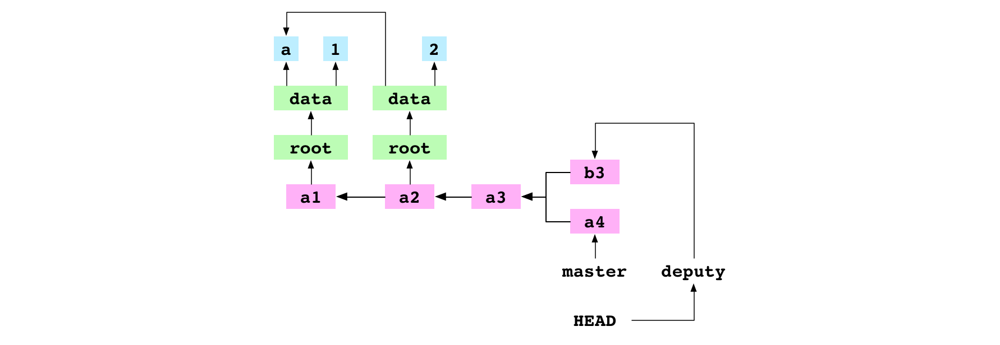

**图属性**：多个提交可以共用一个父提交，这意味着我们可以在提交历史里创建新的提交线。

**图属性**：一个提交可以有多个父提交，这意味着我们可以通过创建一个合并提交来合并两个不同的提交线。

```
~/alpha $ git merge master -m 'b4'
          Merge made by the 'recursive' strategy.
```

合并`master`到`deputy`。

Git发现目的提交`b3`和源提交`a4`在两个不同的提交线上，它创建了一个合并提交。这个过程总共分八步。

第一步，Git将源提交的哈希值写入文件`alpha/.git/MERGE_HEAD`。若此文件存在，说明Git正在做合并操作。

第二步，Git查找源提交和目的提交的最近一个公共父提交，即基提交。


**图属性**：每个提交都有一个父提交。这意味着我们可以发现两个提交线分开自哪个提交。Git查找`b3`和`a4`的所有祖先提交，发现了最近的公共父提交`a3`。这正是他们的基提交。

第三步，Git为基提交、源提交和目的提交创建索引。

第四步，Git创建源提交和目的提交相对于基提交的差异，此处的差异是一个列表，每一项由文件路径以及文件状态组成。状态包括：添加、移除、修改、冲突。

Git获取基提交、源提交和目的提交的文件列表，然后针对每一个文件，通过对比index来判断它的状态。Git将文件列表及状态写入差异列表。在我们的例子中，差异包含两个条目。

第一项记录`data/letter.txt`的状态。在基提交、目的提交和源提交中，该文件内容分别是`a`、`b`和`a`。文件内容在基提交和目的提交不同，但在基提交和源提交相同。Git发现文件内容被目的提交修改了，而在源提交中没有被修改。所以`data/letter.txt`项的状态是修改，而不是冲突。

第二项记录`data/number.txt`的状态。在我们的例子中，该文件内容在基提交和目的提交相同，但在基提交和源提交不同。这个条目的状态也是修改。

**图属性**：查找一个合并操作的基提交是可行的。这意味着，如果基提交中的一个文件只在源提交或目的提交做了修改，Git可以自动合并该文件，这样就减少了用户的工作量。

第五步，Git将差异中的项更新到工作区。`data/letter.txt`内容被修改为`b`，`data/number.txt`内容被修改为`4`。

第六步，Git将差异中的项更新到index。`data/letter.txt`会指向内容为`b`的blob，`data/number.txt`会指向内容为`4`的blob。

第七步，更新后的index被提交：

```
tree 20294508aea3fb6f05fcc49adaecc2e6d60f7e7d
parent 982dffb20f8d6a25a8554cc8d765fb9f3ff1333b
parent 7b7bd9a5253f47360d5787095afc5ba56591bfe7
author Mary Rose Cook <mary@maryrosecook.com> 1425596551 -0500
committer Mary Rose Cook <mary@maryrosecook.com> 1425596551 -0500

b4
```

注意，这个提交有两个父提交。

第八步，Git将当前分支`deputy`指向新创建的提交。

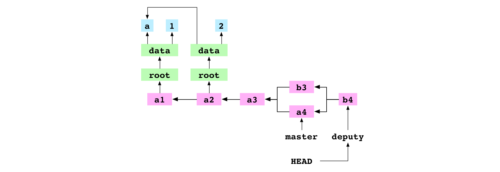

### 合并不同提交线且有相同修改文件的两个提交

```
~/alpha $ git checkout master
          Switched to branch 'master'
~/alpha $ git merge deputy
          Fast-forward
```

检出`master`，将`deputy`合并到`master`。此操作将使用fast-forwards将`master`指向`b4`。现在，`master`和`deputy`指向了相同的提交。

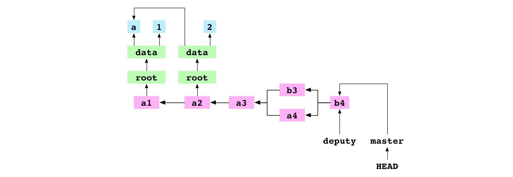

```
~/alpha $ git checkout deputy
          Switched to branch 'deputy'
~/alpha $ printf '5' > data/number.txt
~/alpha $ git add data/number.txt
~/alpha $ git commit -m 'b5'
          [deputy bd797c2] b5
```

检出`deputy`。将`data/number.txt`内容修改为`5`，然后提交。

```
~/alpha $ git checkout master
          Switched to branch 'master'
~/alpha $ printf '6' > data/number.txt
~/alpha $ git add data/number.txt
~/alpha $ git commit -m 'b6'
          [master 4c3ce18] b6
```

检出`master`。将`data/number.txt`内容修改为`6`，然后提交。

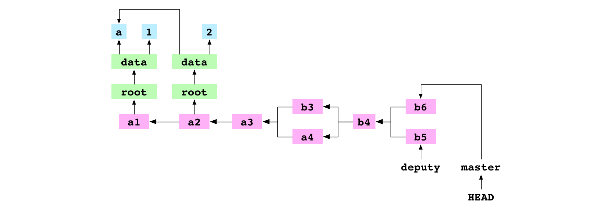

```
~/alpha $ git merge deputy
          CONFLICT in data/number.txt
          Automatic merge failed; fix conflicts and
          commit the result.
```

将`deputy`合并到`master`。合并因冲突中止。对于有冲突的合并操作，执行步骤的前六步跟没有冲突的合并是相同的：写入`.git/MERGE_HEAD`，查找基提交，创建基提交、目的提交和源提交的索引，生成差异，更新工作区，更新index。由于发生了冲突，第七步（创建提交）和第八步（更新ref）不再执行。让我们再来看看这些步骤，观察到底发生了什么。

第一步，Git将源提交的哈希值写入`.git/MERGE_HEAD`。

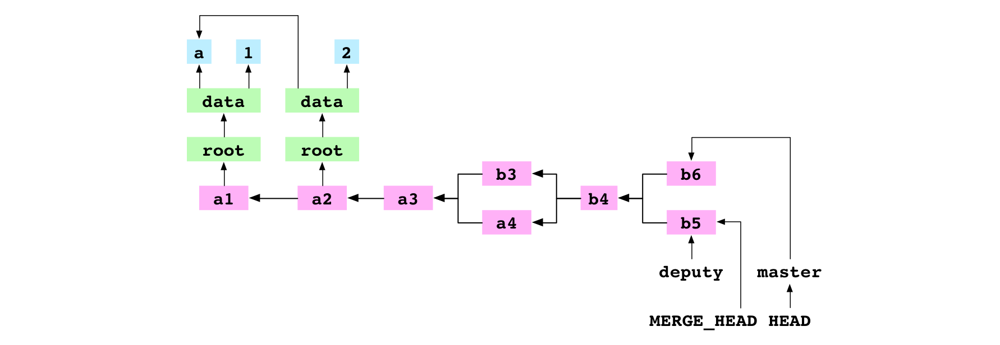

第二步，Git查找到基提交`b4`。

第三步，Git创建基提交、目的提交和源提交的索引。

第四步，Git生成目的提交和源提交相对于基提交的差异列表，每一项包含文件路径和该文件的状态：添加、移除、修改或冲突。

在本例中，差异列表仅包含一项：`data/number.txt`。由于它的内容在源提交和目的提交中都是变化的（相对于基提交），它的状态被标为冲突。

第五步，差异列表中的文件被写入工作区。对于冲突的部分，Git将两个版本都写入工作区。`data/number.txt`的内容变为：

```
<<<<<<< HEAD
6
=======
5
>>>>>>> deputy
```

第六步，差异列表中的文件被写入index。index中的项被文件路径和stage的组合唯一标识。没有冲突的项stage为0。在本次合并前，index看起来像下面的样子（标有0的一列是stage）：

```
0 data/letter.txt 63d8dbd40c23542e740659a7168a0ce3138ea748
0 data/number.txt 62f9457511f879886bb7728c986fe10b0ece6bcb
```

差异列表写入index后，index变成：

```
0 data/letter.txt 63d8dbd40c23542e740659a7168a0ce3138ea748
1 data/number.txt bf0d87ab1b2b0ec1a11a3973d2845b42413d9767
2 data/number.txt 62f9457511f879886bb7728c986fe10b0ece6bcb
3 data/number.txt 7813681f5b41c028345ca62a2be376bae70b7f61
```

stage `0`的`data/letter.txt`项跟合并前一样。stage `0`的`data/number.txt`项已经不复存在，取而代之的是三个新项。stage `1`的项包含该文件在基提交中内容的哈希值，stage `2`包含目的提交的哈希值，stage `3`包含源提交的哈希值。这三项表明文件`data/number.txt`存在冲突。

合并中止了。

```
~/alpha $ printf '11' > data/number.txt
~/alpha $ git add data/number.txt
```

将两个有冲突的文件合并，这里我们将`data/number.txt`的内容修改为`11`，然后将文件添加到index，以告诉Git冲突已经解决了。Git为`11`创建一个blob，移除index中的三项`data/number.txt`，并添加stage为`0`的`data/number.txt`项，该项指向新创建blob。现在index变成了：

```
0 data/letter.txt 63d8dbd40c23542e740659a7168a0ce3138ea748
0 data/number.txt 9d607966b721abde8931ddd052181fae905db503
```

```
~/alpha $ git commit -m 'b11'
          [master 251a513] b11
```

第七步，提交。Git发现存在`.git/MERGE_HEAD`，也就是说合并还在进行。通过检查index，发现没有冲突。它创建了一个新提交`b11`，用来记录合并后的内容。然后删除`.git/MERGE_HEAD`。此次合并完成。

第八步，Git将当前分支`master`指向新提交。

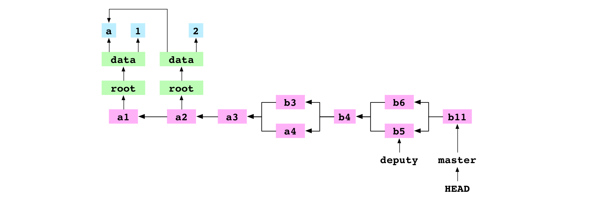

### 移除文件

下图是当前Git的状态图，其中包含了提交历史、最后提交的tree和blob、工作区以及index：

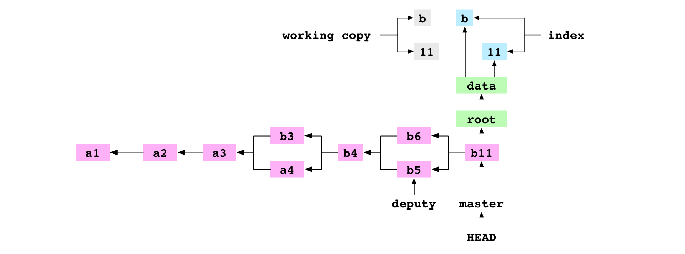

```
~/alpha $ git rm data/letter.txt
          rm 'data/letter.txt'
```

使用Git移除`data/letter.txt`。Git将该文件从工作区和index删除。

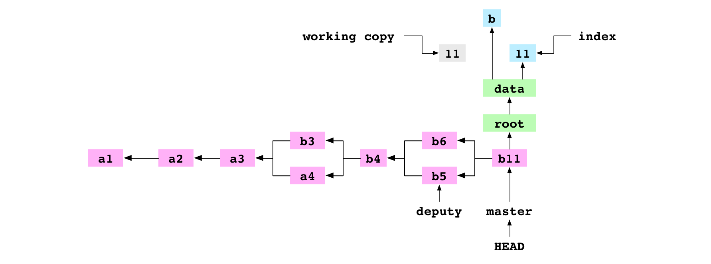

```
~/alpha $ git commit -m '11'
          [master d14c7d2] 11
```

提交变更。按照惯例，Git为index创建一个树图。该树图不再包含`data/letter.txt`，因为它已经从index删除了。

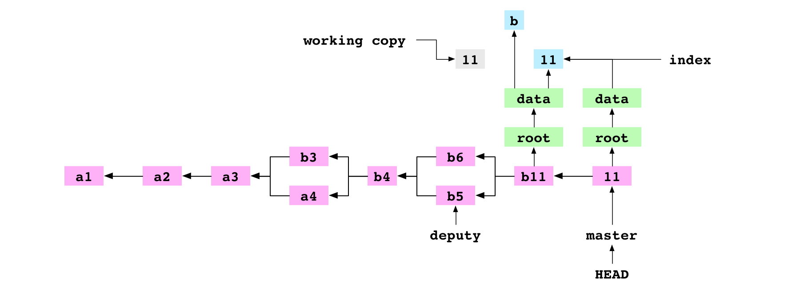

### 拷贝仓库

```
~/alpha $ cd ..
      ~ $ cp -R alpha bravo
```

将`alpha/`拷贝到`bravo/`。此时将出现下面的目录结构：

```
~
├── alpha
│   └── data
│       └── number.txt
└── bravo
    └── data
        └── number.txt
```

现在`bravo`目录存在另一个Git状态图：


### 关联其它仓库

```
      ~ $ cd alpha
~/alpha $ git remote add bravo ../bravo
```

回到`alpha`仓库，将`bravo`设置为`alpha`仓库的远程仓库。该操作将在`alpha/.git/config`添加两行内容：

```
[remote "bravo"]
    url = ../bravo/
```

这两行说明，存在一个远程仓库`bravo`，该仓库位于`../bravo`目录。

### 从远程仓库获取分支

```
~/alpha $ cd ../bravo
~/bravo $ printf '12' > data/number.txt
~/bravo $ git add data/number.txt
~/bravo $ git commit -m '12'
          [master 94cd04d] 12
```

进入`bravo`仓库，将`data/number.txt`内容修改为`12`并提交到`master`。

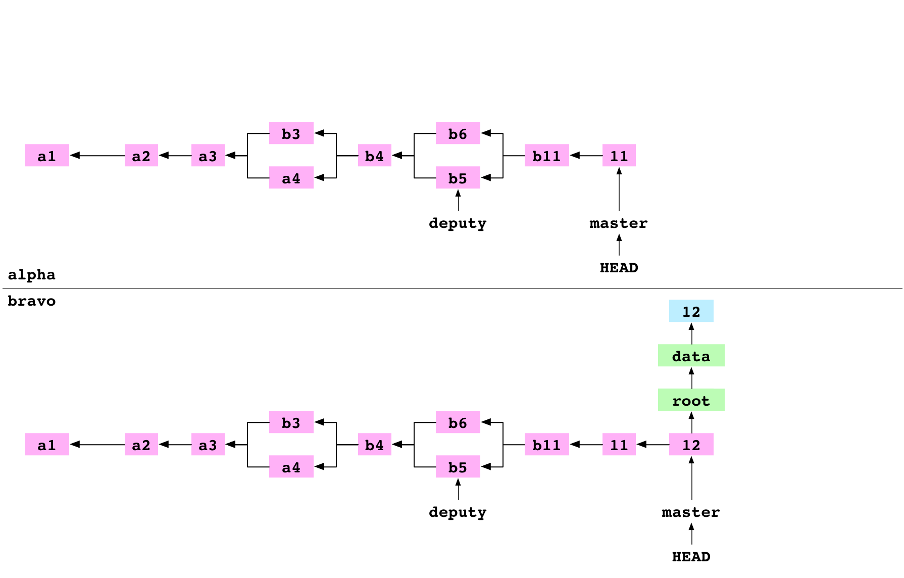

```
~/bravo $ cd ../alpha
~/alpha $ git fetch bravo master
          Unpacking objects: 100%
          From ../bravo
            * branch master -> FETCH_HEAD
```

进入`alpha`仓库，将`bravo`的`master`分支取回到`alpha`。该操作分四步。

第一步，Git获取`bravo`仓库中`master`指向提交的哈希值，也就是提交`12`的哈希值。

第二步，Git创建一个包含了`12`提交依赖的所有对象的列表，包括提交对象本身和祖先提交，以及它们的树图内的所有对象。它将`alpha`对象数据库中已经存在的对象从列表中移除。然后将列表的对象拷贝到`alpha/.git/objects/`。

第三步，Git将ref文件`alpha/.git/refs/remotes/bravo/master`的内容更新为提交`12`的哈希值。

第四步，`alpha/.git/FETCH_HEAD`的内容被设置为：

```
94cd04d93ae88a1f53a4646532b1e8cdfbc0977f branch 'master' of ../bravo
```

这表示最近一次执行fetch命令获取的是`bravo`中`master`分支的提交`12`。

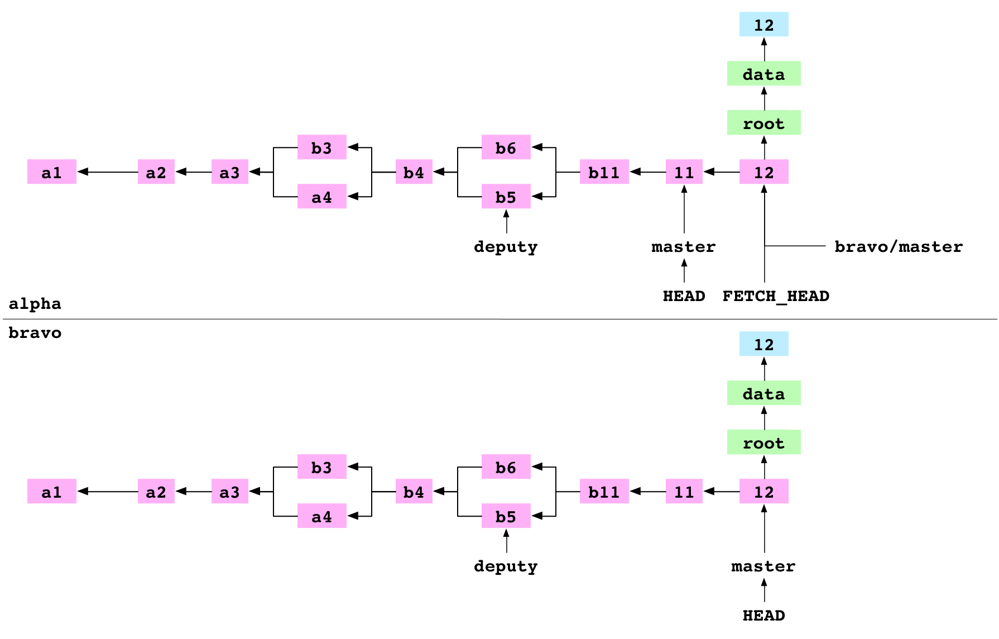

**图属性**：对象可以被拷贝。这意味着提交历史可以被不同仓库共享。

**图属性**：仓库可以保存远程分支的ref，如`alpha/.git/refs/remotes/bravo/master`。这意味着仓库可以将远程仓库的分支状态记录到本地。在获取该分支时，它将会被修正，但如果远程分支修改了，它就会过期。

### 合并FETCH_HEAD

```
~/alpha $ git merge FETCH_HEAD
          Updating d14c7d2..94cd04d
          Fast-forward
```

合并`FETCH_HEAD`。`FETCH_HEAD`只是另一个ref，它解析到源提交`12`。`HEAD`指向目的提交`11`。Git使用fast-forward合并将`master`指向`12`提交。

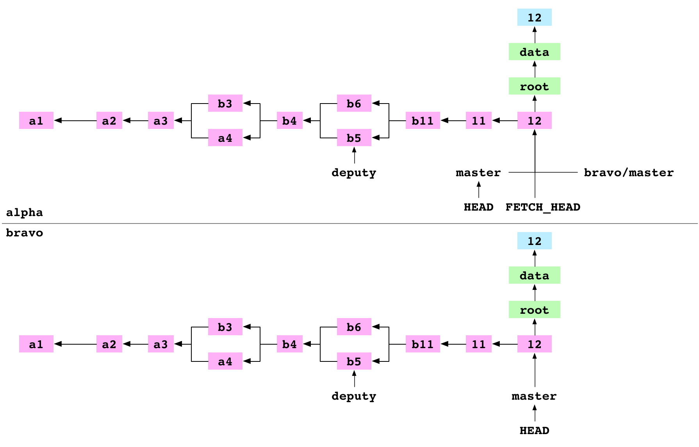

### 从远程仓库拉取分支

```
~/alpha $ git pull bravo master
          Already up-to-date.
```

将`bravo`仓库的`master`分支拉取到`alpha`仓库。pull是”fetch and merge `FETCH_HEAD`“的简写。Git执行这条命令然后报告`master`分支`Already up-to-date`。

### 克隆仓库

```
~/alpha $ cd ..
      ~ $ git clone alpha charlie
          Cloning into 'charlie'
```

进入上层目录，克隆`alpha`到`charlie`。克隆到`charlie`和我们之前使用`cp`拷贝`bravo`仓库的结果是相同的。Git首先创建一个目录`charlie`，然后将`charlie`初始化为一个Git仓库，将`alpha`添加为一个远程仓库`origin`，获取`origin`并合并到`FETCH_HEAD`。

### 推送分支到远程仓库的已检出分支

```
      ~ $ cd alpha
~/alpha $ printf '13' > data/number.txt
~/alpha $ git add data/number.txt
~/alpha $ git commit -m '13'
          [master 3238468] 13
```

返回`alpha`仓库，将`data/number.txt`修改为`13`，然后提交到`alpha`仓库的`master`分支。

```
~/alpha $ git remote add charlie ../charlie
```

将`charlie`设为`alpha`仓库的远程分支。

```
~/alpha $ git push charlie master
          Writing objects: 100%
          remote error: refusing to update checked out
          branch: refs/heads/master because it will make
          the index and work tree inconsistent
```

将`master`推送到`charlie`仓库。

`13`提交依赖的所有对象都被拷贝到`charlie`仓库。

此时，推送操作中止了。Git给出了出错信息，它拒绝将分支推送到远程已检出的分支上。这在情理之中，因为如果推送成功，远程分支的index和`HEAD`将会改变。如果此时有人正在编辑远程分支的工作区，他就懵b了。

此时，我们可以创建一个新的分支，将`13`提交合并进来，然后推到`charlie`。但是我们往往希望仓库可以随时提交。我们希望有一个中心仓库可以用来做同步，而又没有人可以直接在远程仓库仓库，就像Github一样。这时我们就需要一个裸仓库(bare repository)。

### 克隆裸仓库

```
~/alpha $ cd ..
      ~ $ git clone alpha delta --bare
          Cloning into bare repository 'delta'
```

返回上层目录，克隆出一个裸仓库`delta`。这跟普通的克隆只有两点不同：`config`文件会指明该仓库是一个裸仓库，之前在`.git`目录的文件现在直接放在仓库目录下：

```
delta
├── HEAD
├── config
├── objects
└── refs
```

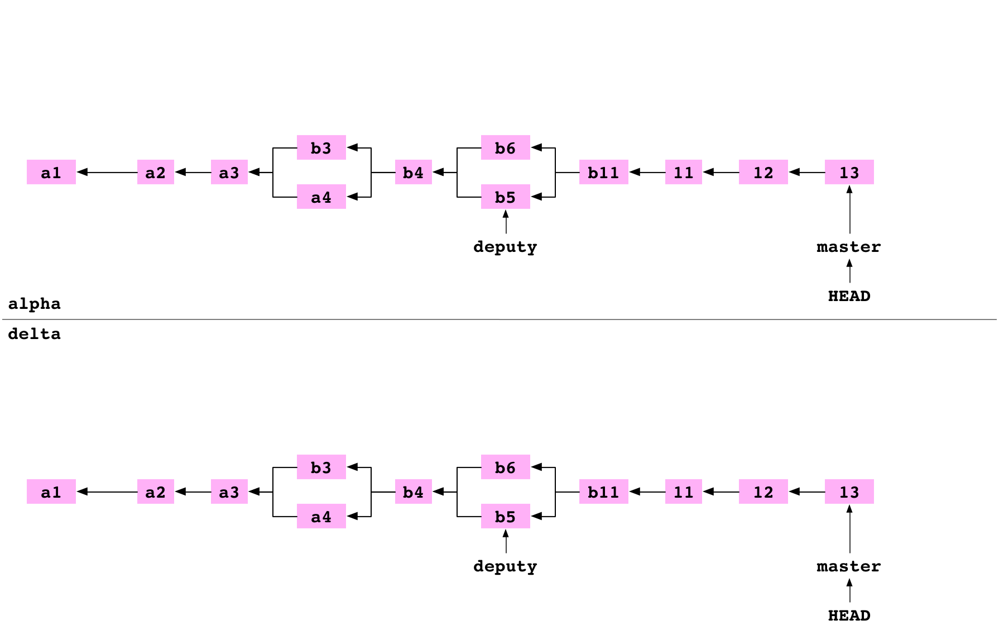

### 推送分支到裸仓库

```
      ~ $ cd alpha
~/alpha $ git remote add delta ../delta
```

回到`alpha`仓库，将`delta`仓库设为`alpha`的远程仓库。

```
~/alpha $ printf '14' > data/number.txt
~/alpha $ git add data/number.txt
~/alpha $ git commit -m '14'
          [master cb51da8] 14
```

将`data/number.txt`内容修改为`14`并提交到`alpha`的`master`分支。


```
~/alpha $ git push delta master
          Writing objects: 100%
          To ../delta
            3238468..cb51da8 master -> master
```

将`master`推送到`delta`。此操作分三步。

第一步，`master`分支上`14`提交依赖的所有对象都被从`alpha/.git/objects/`拷贝到`delta/objects`。

第二步，`delta/refs/heads/master`更新为`14`提交。

第三步，`alpha/.git/refs/remotes/delta/master`更新为`14`提交。`alpha`记录了`delta`更新后的状态。

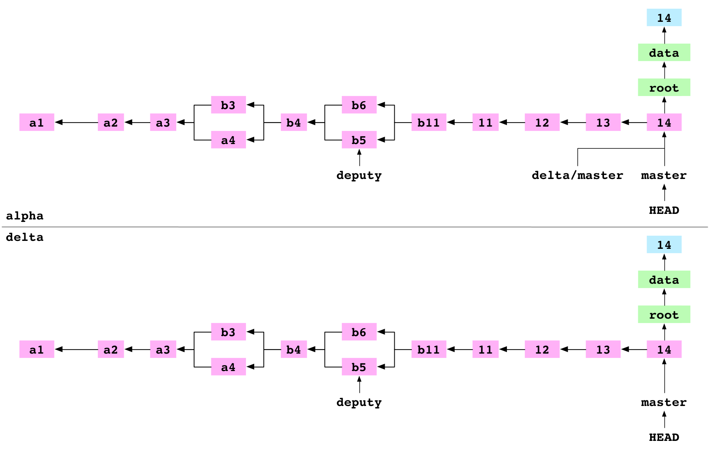

### 总结

Git构建在图上，几乎所有的Git命令都是在操作这个图。想要深入了解Git，关注图属性而不是执行流程或命令。

想要学习更多Git知识，可以研究一下`.git`目录。没什么可怕的。看看它里面有哪些东西。修改文件内容，观察发生了什么。手动创建一个提交，看看你能把仓库搞得多惨。然后试着修复它。

### 脚注

1. 在这个例子中，哈希值内容比原文件更长。不管是否能节约空间，Git始终选择使用哈希值作为文件名。
2. 也有可能两个不同的内容有相同的哈希值，但这个可能性很低。
3. `git prune`删除所有不能被ref访问到的对象。执行此命令可能会丢失数据。
4. `git stash`将工作区和`HEAD`提交的所有差异保存到一个安全的地方。它们可以在以后取回。
5. `rebase`命令可以用来添加、编辑或删除历史提交。

### 译者注

本文翻译已取得原作者MaryRosecook同意。
