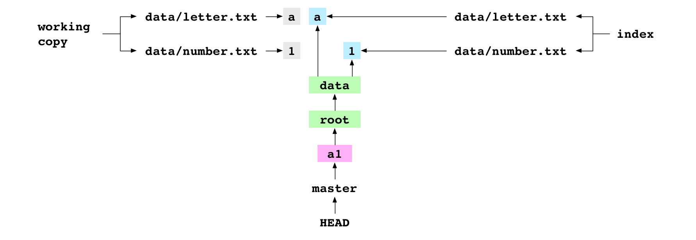
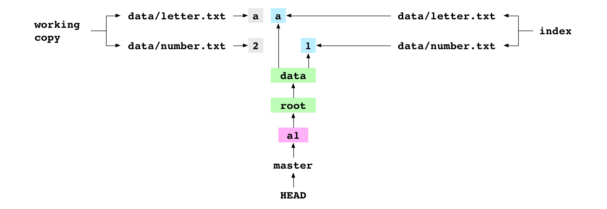
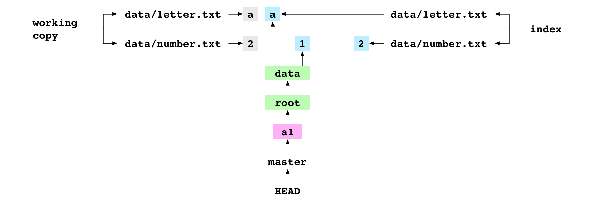

Translated from <http://maryrosecook.com/blog/post/git-from-the-inside-out>.

## 彻底理解Git

本文主要解释git的工作原理。如果你是一个视频党，请移步[youtube视频](https://www.youtube.com/watch?v=fCtZWGhQBvo)。

本文假设你已经有能力使用git来对项目做版本控制。我们主要考察支撑git的图结构和指导git行为的图属性。在考察原理时，我们会创建真实的状态模型，而不是通过各种实验的结果妄做猜想。通过这个真实的状态模型，我们可以更直观地了解git已经做了什么，正在做什么，以及接下来要做什么。

本文结构组织为一系列的git动作，针对一个单独的项目展开。我们偶尔会观察一下git当前状态的图结构，并解释图属性及其产生的行为。

如果你读完本文后仍意犹未尽，可以看一下[maryrosecook对Git的JavaScript实现](http://gitlet.maryrosecook.com/docs/gitlet.html) ，里面包含了大量注释。

### 创建项目

    ~ $ mkdir alpha
    ~ $ cd alpha

创建项目目录`alpha`。

    ~/alpha $ mkdir data
    ~/alpha $ printf 'a' > data/letter.txt

进入`alpha`目录，创建目录`data`。在`data`目录下，创建内容为`a`的文件`letter.txt`。终了，`alpha`的目录结构如下：

    alpha
    └── data
        └── letter.txt

### 初始化仓库

    ~/alpha $ git init
    Initialized empty Git repository

`git init`命令将当前目录加到Git仓库。为此，它会在当前目录下创建一个`.git`目录并写入一些文件。这些文件记录了Git配置和版本历史的所有东西。它们都是一些普通的文件，没什么特别。用户可以使用编辑器或shell对它们进行浏览或编辑。也就是说，用户可以像编辑他们的项目文件一样来浏览或编辑项目的版本历史。

现在，`alpha`的目录结构变成了这个样子：

    alpha
    ├── data
    │   └── letter.txt
    └── .git
        ├── objects
        etc...

`.git`目录及内容是由Git创建的。其它文件组成工作区，由用户创建。

### 添加文件

    ~/alpha $ git add data/letter.txt

添加文件`data/letter.txt`到Git。此操作有两个影响。

第一，它会在`.git/objects/`目录下创建一个新的blob文件。

这个blob文件包含了`data/letter.txt`文件压缩后的内容。文件名取自内容的哈希值。哈希意味着执行一段算法，将给定内容转换为更小的，且能唯一确定原内容的值的过程。例如，Git对`a`作哈希得到`2e65efe2a145dda7ee51d1741299f848e5bf752e`。哈希值的头两个字符用作对象数据库的目录名：`.git/objects/2e/`，剩下的字符用作blob文件的文件名：`.git/objects/2e/65efe2a145dda7ee51d1741299f848e5bf752e`。

注意刚才添加文件时Git是如何把它的内容保存到`objects`目录的。即使我们从工作区把`data/letter.txt`文件删掉，它的内容在Git内仍然不会丢失。

第二，它会将`data/letter.txt`文件添加到index。index是一个文件列表，它记录有我们想要跟踪的所有文件。它保存为`.git/index`文件，每一行维护一个文件名到（添加到index时的）文件内容哈希值的映射。执行`git add`命令后的index如下：

    data/letter.txt 2e65efe2a145dda7ee51d1741299f848e5bf752e

创建一个内容为`1234`的文件`data/number.txt`。

    ~/alpha $ printf '1234' > data/number.txt

现在工作区的目录结构：

    alpha
    └── data
        ├── letter.txt
        └── number.txt

将`data/number.txt`文件加入到Git。

    ~/alpha $ git add data

`git add`命令添加一个包含`data/number.txt`内容的blob对象，然后添加一个index项将`data/number.txt`指向刚刚创建的blob对象。执行完后的index：

    data/letter.txt 2e65efe2a145dda7ee51d1741299f848e5bf752e
    data/number.txt 274c0052dd5408f8ae2bc8440029ff67d79bc5c3

注意，虽然我们执行的是`git add data`，但只有`data`目录内的文件被加到index。`data`目录不会被加入。

    ~/alpha $ printf '1' > data/number.txt
    ~/alpha $ git add data

我们原打算在`data/number.txt`内写入`1`而不是刚才的`1234`，现在修正一下，然后将文件重新加到index。这条命令会为新的内容重新生成一个新的blob文件，并更新`data/number.txt`在index中的指向。

### 创建提交

    ~/alpha $ git commit -m 'a1'
              [master (root-commit) 774b54a] a1

我们创建了一个提交`a1`。Git打印出此次提交的简短描述。

提交命令对应三步操作。创建提交版本对应的文件内容的树图，创建一个提交对象，然后将当前分支指向该提交。

#### 创建树图

树图记录着index内对应文件 (即项目文件) 的位置和内容，Git通过树图来记录项目的当前状态。

树图有两类对象组成：blob和tree。

blob是在执行`git add`命令时创建的，用来保存项目文件的内容。

tree是在创建提交时产生的，一个tree代表着工作区的一个目录。

创建提交后，记录`data`目录内容的tree对象如下：

    100664 blob 2e65efe2a145dda7ee51d1741299f848e5bf752e letter.txt
    100664 blob 56a6051ca2b02b04ef92d5150c9ef600403cb1de number.txt

第一行记录了恢复`data/letter.txt`文件需要的所有信息。第一部分表示该文件的权限，第二部分表示该行记录的是一个blob对象，第三行表示该blob的哈希值，第四行表示文件名。

第二行是`data/number.txt`文件的信息。

下面是`alpha`目录 (项目的根目录) 的树对象：

    040000 tree 0eed1217a2947f4930583229987d90fe5e8e0b74 data

这仅有的一行指向`data`这个树对象。

上图中，`root`树指向了`data`树，而`data`树指向了`data/letter.txt`和`data/number.txt`这两个blob。

#### 创建提交对象

`git commit`在创建完树图后会创建一个提交对象。提交对象是`.git/objects/`目录下的另一种文本文件：

    tree ffe298c3ce8bb07326f888907996eaa48d266db4
    author Mary Rose Cook <mary@maryrosecook.com> 1424798436 -0500
    committer Mary Rose Cook <mary@maryrosecook.com> 1424798436 -0500

    a1

第一行指向一棵树。通过这里的哈希值，我们可以找到一个指向工作区根目录（即alpha目录）的tree对象。最后一行是提交信息。

#### 将当前分支指向新提交

最后，commit命令将当前分支指向新的提交。

那么，哪个是当前分支呢？Git查看保存`HEAD`的文件`.git/HEAD`，此时它的内容是：

    ref: refs/heads/master

好了，`HEAD`现在指向`master`，`master`就是我们的当前分支。

`HEAD`和`master`都是引用。引用即一个标记，Git或用户通过它来找到某个提交。

代表`master`引用的文件还不存在，因为这是我们在该仓库的第一个提交。不过不用担心，Git会创建该文件`.git/refs/heads/master`并写入提交对象的哈希值：

    74ac3ad9cde0b265d2b4f1c778b283a6e2ffbafd

注意：如果你是跟着本文边读边敲，你的`a1`提交生成的哈希值会跟上值不同。像blob和tree这样以内容计算哈希的对象，它们的哈希值与本文相同。提交不然，因为它的哈希值包含了日期和提交作者的信息。

现在把`HEAD`和`master`加到图里：

`HEAD`指向`master`，这跟提交前一样。但是`master`现在已经存在了，而且它指向了新的提交对象。

### 创建第二个提交

下图是提交`a1`后的Git状态图 (包含工作区和index)：

值得一提的是，工作区、index和`a1`提交的`data/letter.txt`和`data/number.txt`的文件内容是一致的。index和`HEAD`都通过blob对象来获取文件内容，而在工作区，文件内容直接保存在文件里。

    ~/alpha $ printf '2' > data/number.txt

修改`data/number.txt`的内容为`2`。这个操作只修改了工作区，index和`HEAD`不变。

    ~/alpha $ git add data/number.txt

将文件添加到Git。此操作将在`objects`目录下添加一个内容为`2`的blob对象，然后将`data/number.txt`在index中的条目指向该对象。

    ~/alpha $ git commit -m 'a2'
              [master f0af7e6] a2

提交此次修改。Git在这里做的操作跟之前第一次提交时相同。

第一步，创建包含index中文件列表的树图。

`data/number.txt`在index中的条目已经改变了，老的`data`树不能再反映`data`目录现在的状态了，此时一棵新的`data`树会被创建：

    100664 blob 2e65efe2a145dda7ee51d1741299f848e5bf752e letter.txt
    100664 blob d8263ee9860594d2806b0dfd1bfd17528b0ba2a4 number.txt

新的`data`树跟之前的`data`树具有不同的哈希值，为记录这一变化，新的`root`树会被创建：

    040000 tree 40b0318811470aaacc577485777d7a6780e51f0b data

第二步，一个新的commit对象会被创建。

    tree ce72afb5ff229a39f6cce47b00d1b0ed60fe3556
    parent 774b54a193d6cfdd081e581a007d2e11f784b9fe
    author Mary Rose Cook <mary@maryrosecook.com> 1424813101 -0500
    committer Mary Rose Cook <mary@maryrosecook.com> 1424813101 -0500

    a2

commit对象的第一行指向新的`root`树，第二行指向父提交`a1`。Git会查看`HEAD`，找到当前分支master，进而找到上个提交的哈希值。

第三步，将新提交的哈希值写入记录`master`分支的文件。

**图属性**：提交内容被保存为对象组成的树，这意味着对象数据库内只保存差异文件。看上图，`a2`提交重用了`a1`提交前生成的`a`blob。同样的，如果一个目录在提交前后没有变化，那么这个目录及其子目录的tree对象和blob对象都可以重用。通常，我们的单个提交只包含极少的变化，这意味着Git可以使用极少的磁盘空间保存大量提交历史。

**图属性**：每个提交都有一个父提交，所以仓库可以记录项目提交历史。

**图属性**：refs是某段提交历史的入口，我们可以给某个提交一个有意义的名字。用户将工作组织成不同版本线，并赋予有意义的refs，如`fix-for-bug-376`。Git使用符号链接来操作历史，如`HEAD`、`MERGE_HEAD`和`FETCH_HEAD`。

**图属性**：`objects/`目录下的节点是不可变的，内容可以编辑，但不能删除。添加的文件和创建的提交都保存在`objects`目录下。

**图属性**：refs是可变的。因此，一个分支的状态是可以修改的。`master`分支指向的提交可能是项目当前最好的版本，但它会被一个新的更好的提交取代。

**图属性**：工作区和refs指向的提交可以被轻易访问到，访问其它提交会麻烦一点。最近的提交历史更容易被访问，但它们也是最经常被修改的。或者说，Git很健忘，需要我们不停的去鞭策。

工作区是在提交历史里最容易找到，它就在仓库的根目录，并不需要执行Git命令。它也是提交历史中最经常被改变的，用户可以针对一个文件修改N个版本，但Git只在执行`add`时才会记录。

`HEAD`指向的提交很容易找到，它就是检出分支的最近一个提交。执行`git statsh`命令后的工作区，即是它的内容。同时，`HEAD`也是最经常修改的ref。

其它ref指向的提交也很容易找到，我们只要把它们检出就可以了。修改分支没有修改`HEAD`来得经常，但涉及到该分支所代表的功能，该分支也是要经常修改的。

没有被ref指向的提交是很难找到的。在某个ref上的提交越多，之前的提交就越不容易被找到，但是谁又会关心很久之前的提交呢。

### 检出提交

    ~/alpha $ git checkout 37888c2
              You are in 'detached HEAD' state...

使用`a2`的哈希值检出该提交。(此命令不能直接运行，请先使用`git log`找到`a2`在你自己仓库的哈希值。)

检出操作分四步。

第一步，Git找到`a2`提交指向的树图。

第二步，将树图里对应的文件写到工作区。这一步不会产生任何变化。工作区的内容已经和树图保持一致了，因为我们的`HEAD`已经通过`master`指向`a2`提交了。

第三步，将树图里对应的文件写到index。这一步也不会产生任何变化。index也已经跟树图的内容保持一致了。

第四步，将`a2`的哈希值写入`HEAD`:

    f0af7e62679e144bb28c627ee3e8f7bdb235eee9

将`HEAD`内容设置为某个哈希值会导致仓库进入detached `HEAD`状态。注意下图中的`HEAD`，它直接指向`a2`提交，而不再指向`master`。

    ~/alpha $ printf '3' > data/number.txt
    ~/alpha $ git add data/number.txt
    ~/alpha $ git commit -m 'a3'
              [detached HEAD 3645a0e] a3

将`data/number.txt`的内容修改为`3`并提交。Git查看`HEAD`来确定`a3`的父提交。它并没有发现分支，而是找到了`a2`的哈希值。

Git将`HEAD`更新为`a3`的哈希值。此时仓库仍然处于detached `HEAD`状态，而并没有在一个分支上，因为没有ref指向`a3`或它之后的提交。这意味着它很容易丢失。

从现在起，我们将在Git状态图里忽略tree和blob。

### 创建分支

    ~/alpha $ git branch deputy

创建一个新分支`deputy`。该操作只是创建一个新文件`.git/refs/heads/deputy`，并把`HEAD`指向的`a3`提交的哈希值写入该文件。

**图属性**：分支只是ref，而ref只是文件。这意味着Git的分支是很轻量的。

创建`deputy`分支使得`a3`附属到了该分支上，`a3`现在已经安全了。`HEAD`仍然处于detached状态，因为它仍直接指向一个提交。

### 检出分支

    ~/alpha $ git checkout master
              Switched to branch 'master'

检出`master`分支。

第一步，Git会获取`master`指向的提交`a2`，根据`a2`获取该分支对应的树图。

第二步，Git将树图对应的文件写入工作区。此步会将`data/number.txt`的内容设置为`2`。

第三步，Git将树图对应的文件写入index。此步会将index内的`data/number.txt`更新为`2`这个blob的哈希值。

第四步，Git将`HEAD`指向`master`，即将`HEAD`内容由哈希值改为：

    ref: refs/heads/master

### 检出与工作区有冲突的分支

    ~/alpha $ printf '789' > data/number.txt
    ~/alpha $ git checkout deputy
              Your changes to these files would be overwritten
              by checkout:
                data/number.txt
              Commit your changes or stash them before you
              switch branches.

用户小手一抖，将`data/number.txt`文件的内容改成了`789`，然后试图检出`deputy`。Git阻止了这场血案。

`HEAD`指向`master`，`master`指向`a2`，`data/number.txt`文件在`a2`提交时的内容是`2`。`deputy`指向`a3`，该文件在`a3`提交时的内容是`3`。而在工作区中，该文件内容是`789`。这些版本的文件内容都不相同，我们必须先解决这些差异。

Git当然可以使用要检出的文件内容替换工作区的文件内容，但这样会导致文件内容的丢失。

Git也可以把要检出的文件内容合并到工作区，但这要复杂的多。

所以Git终止了检出操作。

    ~/alpha $ printf '2' > data/number.txt
    ~/alpha $ git checkout deputy
              Switched to branch 'deputy'

现在我们意识到了这次失误，将文件改回原内容。现在可以成功检出`deputy`了。

### 合并父提交

    ~/alpha $ git merge master
              Already up-to-date.

将`master`合并到`deputy`。合并两个分支意味着合并他们的提交。`deputy`指向的提交是接收方。`master`指向的提交是提供方。Git不会对本次合并做任何操作，只是提示`Already up-to-date.`。

**图属性**：这一系列的提交被解释为对仓库内容的一系列更改。这意味着，如果提供方是接收方的父提交，Git将不会做合并操作。这些修改已经被合并过了。

### 合并子提交

    ~/alpha $ git checkout master
              Switched to branch 'master'

检出`master`。

    ~/alpha $ git merge deputy
              Fast-forward

将`deputy`合并到`master`。Git发现接受方`a2`是提供方`a3`的父提交。Git使用了fast-forward合并。

Git获取提供方的提交和它指向的树图，将树图的文件写入工作区和index。然后使用"fast-forward"技术将`master`指向`a3`。

**图属性**：这一系列的提交被解释为对仓库内容的一系列更改。这意味着，如果提供方是接收方的子提交，提交历史是不会改变的，因为已经存在一段提交来描述接受方和提供方之间的变化。但是Git的状态图是会改变的。`HEAD`指向的`ref`会更新为提供方的提交。

### 合并来自不同提交线的两个提交

### 合并来自不同提交线且有相同修改文件的两个提交

### 移除文件

### 拷贝仓库

### 把仓库关联到其它仓库

### 从远程仓库取回分支

### 合并FETCH_HEAD

### 从远程仓库取回并合并分支

### 克隆仓库

### 推送分支到远程仓库的检出分支

### 克隆裸仓库

### 推送分支到裸仓库

### 总结
